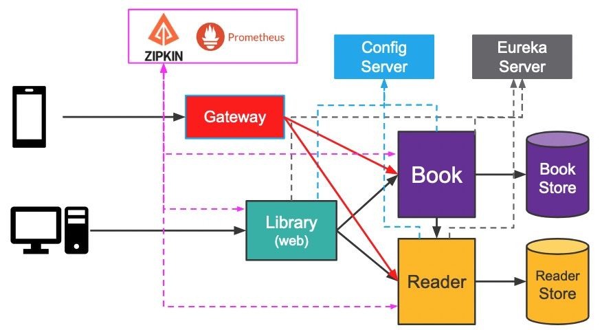

  
# How to build microservices leveraging Spring Boot and Spring Cloud 
  
  
This repo contains a series of demos that aims to show how to build microservices using:  
[Spring Data JDBC](https://spring.io/projects/spring-data-jdbc) which implements DDD and hugely simplifies the persistence layer in comparison to JPA  
[Spring Cloud](https://spring.io/projects/spring-cloud) projects:  
- **Spring Cloud Netflix** - service discovery
- **Spring Cloud OpenFeign** - resilient communication
- **Spring Cloud Config** - externalised configuration
- **Spring Cloud Contract** - Consumer Driven Contracts
- **Spring Cloud Gateway** - API gateway
- **Spring Cloud Sleuth**  - distributed tracing
 
The journey starts with a naive implementation of one front-end web application backed by two microservices without considering the challenges faced when building large distributed systems.    
Each demo gradually addresses common problems faced by microservices in production, such as: service discovery and communication, load balancing, partial failures (timeouts and retries), 
externalised configuration, contract testing, API routing, monitoring/metrics and distributed tracing.  
  
The final architecture is depicted below:  
  
  
  
Each service binds to Eureka Server to discover all the others and start automatically using *client-side load balancing* through **OpenFeign**.  
All services have been configured to report trace data (spans) to a Zipkin server.
  
## Testing locally:
If you have docker installed on your machine, you can easily run [Zipkin](https://zipkin.io/) and [Prometheus](https://prometheus.io/) in containers by simply executing `docker-compose up`  
The build process requires that your machine have Maven installed as it is used by **Spring Cloud Contract**.  
Execute `./scripts/build.sh` to build everything.  
Execute `./scripts/run.sh` to start everything up:  

__URLs:__  
- Registry Server (Eureka): `localhost:8761`
- Config Server (Book Service): `localhost:8888/library-book-service/default`
- Config Server (Reader Service): `localhost:8888/library-reader-service/default`
- Config Server (Library application): `localhost:8888/library-msa/default`
- Config Server (API Gateway): `localhost:8888/library-gateway/default`
- API Gateway: `localhost:8181`
- Zipkin Server: `localhost:9411`
- Prometheus Server: `localhost:9090`
- Application: `localhost:8080`  
  
You can generate 10 library readers at a time clicking on the *Load Readers* button.  
You can generate 100 library books at a time clicking on the *Load Books* button. The first 40 books will evenly be assigned to some readers.  
You can visualise the list of readers and books following the corresponding links. Use the browser's back button to return to the home page.  

You can also access the backend services RESTful APIs through the API Gateway. For example, using [httpie](https://httpie.io/) API testing client:  
```bash
http post "localhost:8181/library-reader-service/readers/commands/load?count=10"
http post "localhost:8181/library-book-service/books/commands/load?count=100"
http localhost:8181/library-reader-service/readers
http localhost:8181/library-book-service/books
http post "localhost:8181/library-book-service/books/commands/borrow" readerId=2 bookIds:='[73]'
http post "localhost:8181/library-book-service//books/commands/return" readerId=2 bookIds:='[73]'
http post localhost:8181/library-reader-service/readers/commands/cleanup
http post localhost:8181/library-book-service/books/commands/cleanup
```
After having used the application, you can now:  

- access Zipkin to inspect the interactions between the services: 
  

  
- access Prometheus to visualise metrics pulled from the services:
  

  
## Architectural Decisions:
  
1. The application adopts the microservice architecture where each service contains a *Domain-Driven Design (DDD) aggregate*.
  
1. Each microservice follows the [Clean Architecture](https://blog.cleancoder.com/uncle-bob/2012/08/13/the-clean-architecture.html) architectural pattern.

1. The backend services expose their APIs using REST which is made easy by **Spring Boot**.  

1. The front-end application implements the *Model-View-Controller (MVC)* architectural pattern which is made easy by **Spring MVC**.  

1. Each service can easily consume other services' RESTful APIs thanks to the declarative programming model offered by **Spring Cloud OpenFeign**.  

1. End-to-end tests become counter-productive for microservices. Instead, each service can be tested in isolation using (consumer-driven) contract testing supported by **Spring Cloud Contract**.

1. This solution leverages a **Service Registry**, a **Config Service**, and an **API Gateway**, all of them implemented using **Spring Cloud** projects.  

1. The backend service's persistence layer is implemented by SQL databases. Both **Reader** and **Book** services use H2 embedded in-memory database when running locally which is made easy by **Spring Boot**.
