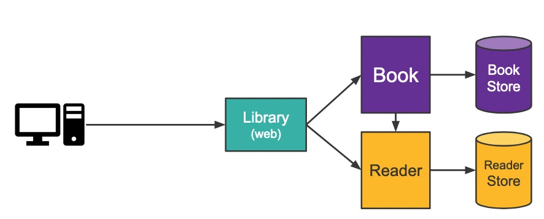

## Naive Implementation de Microservices

- Each service's persistence layer is implemented using JPA which makes it unnecessarily unwieldy for a small codebase.
- All inter-service communications are manually implemented without considering the difficulties of distributed computing.
- All configurations are kept inside each service which makes it harder to manage them consistently.
- E2E tests are the only way to test the interactions between services.
- External consumers need to know where to find each service.
- No metrics are exposed and there is no easy way of tracking user requests as they flow from the front-end application 
to backend services.

  
